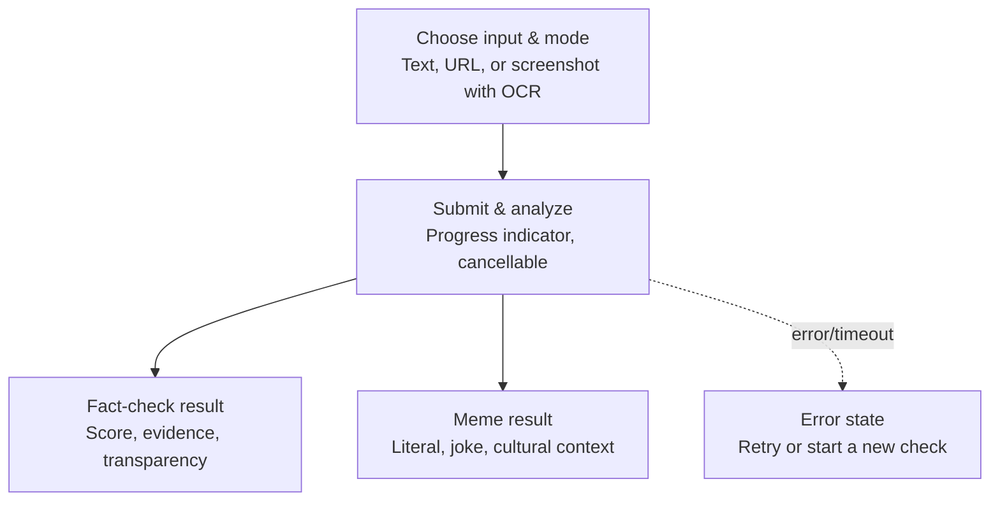
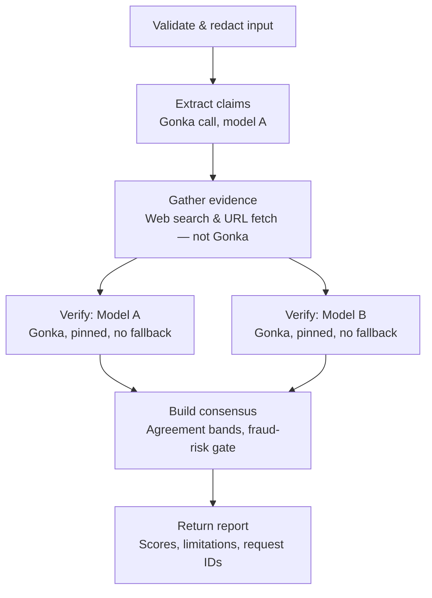

# Team Tenners 
Repo for team tenners
## User Flow

Anxin runs as a single continuous screen rather than separate pages. A user picks how they're submitting content — pasted text, a URL, or a screenshot (run through OCR first) — and chooses whether they want a fact-check or a meme/joke explanation. Once submitted, a cancellable progress indicator tracks the analysis. Fact-checks return a truth score, fraud-risk level, supporting evidence, and an expandable transparency panel showing exactly which models were used and their raw responses. Meme mode instead returns a plain-language explanation of the joke or cultural reference, skipping verification entirely. If anything fails — a Gonka timeout, malformed output, or network issue — the user lands on a clear error state with the option to retry or start over, rather than a silent failure

## Internal Process

Under the hood, a submission goes through six stages. First, input is validated and personally identifiable details are redacted before anything is sent externally. The system then makes its first Gonka call to extract the atomic factual claims from the text using Model A. Evidence gathering happens next, but entirely outside Gonka — this is local web search and URL fetching, not a model call. With claims and evidence in hand, two independent Gonka calls run concurrently: Model A and Model B each verify the claims separately, with no fallback if one is unavailable. Their outputs feed a consensus step that isn't a simple average — fraud risk is taken as the maximum of the two models' scores (so a scam pattern one model catches isn't diluted by the other), and a high fraud-risk verdict overrides the evidence-availability check, since phishing messages often have no retrievable evidence by nature. The final report includes scores, any limitations (e.g. single-model results if one leg failed), and the Gonka request IDs for transparency.